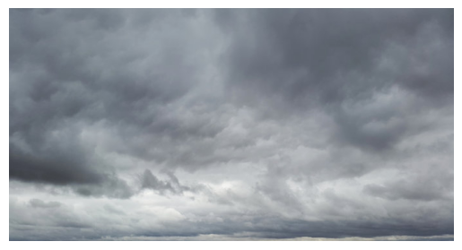
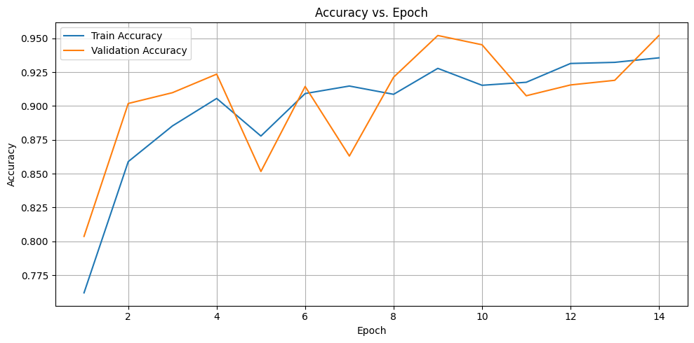
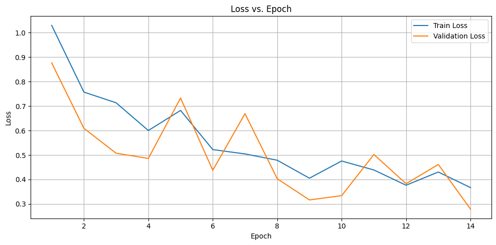
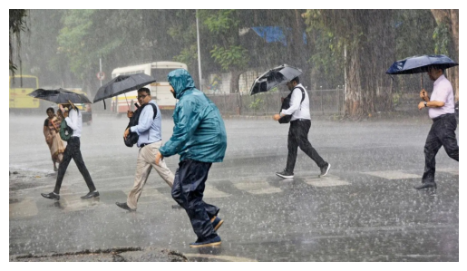

# **☁️ Weather Images Classification ☀️**

Detected: Cloudy Sky

This repository contains a PyTorch-based convolutional neural network (CNN) for classifying weather conditions from images. The model is trained to distinguish between "Cloudy", "Rain", "Shine", and "Sunrise" weather types, aiming for accurate and efficient weather prediction from visual data. Our approach acheived over 95.5% accuracy in real life complex testing scenarios.

## **📝 Table of Contents**

* [Project Overview](#bookmark=id.idb1ugbaa48)  
* [Features](#bookmark=id.g4hd0k8svou7)  
* [Dataset](#bookmark=id.tstzi7zggchj)  
* [Installation](#bookmark=id.7d5srfhefie0)  
* [Usage](#bookmark=id.p6av0zoex7uu)  
* [Model Architecture](#bookmark=id.hvl1222by0u6)  
* [Training](#bookmark=id.jccfc7xgznw2)  
* [Results & Visuals](#bookmark=id.7gaoy8xx8i09)  
* [Contributing](#bookmark=id.qjr8eoua68ku)  
* [License](#bookmark=id.16ev7mjiacxv)  
* [Contact](#bookmark=id.e7e1d4dpdgy2)

## **🚀 Project Overview**

The primary objective of this project is to develop a robust image classification model capable of accurately identifying diverse weather conditions. This technology holds significant potential for various applications, including:

* **Automated Weather Monitoring Systems**: Real-time analysis of environmental conditions.  
* **Smart Home Devices**: Adapting home environments based on current weather.  
* **Personal Photography Organization**: Categorizing images by weather for easier retrieval.

The weather\_classification.ipynb script serves as the core implementation, showcasing:

* Efficient data loading and preprocessing using torchvision.transforms.  
* A custom Dataset class tailored for handling image data.  
* A custom-built CNN architecture leveraging torch.nn for deep learning.  
* A comprehensive training loop incorporating the Adam optimizer and ReduceLROnPlateau scheduler.  
* An early stopping mechanism to prevent overfitting and ensure optimal model performance.  
* Robust evaluation metrics utilizing torchmetrics.Accuracy.

## **✨ Features**

* **Image Preprocessing**: Advanced techniques including resizing, normalization, and data augmentation (horizontal/vertical flips, color jitter, random rotation) to enhance model generalization.  
* **Custom CNN Model**: A highly optimized sequential CNN model specifically designed for intricate image classification tasks.  
* **Comprehensive Training Pipeline**: A meticulously crafted training loop encompassing loss calculation, backpropagation, and optimizer steps for effective model learning.  
* **Dynamic Learning Rate Scheduling**: Adapts the learning rate dynamically based on validation loss, ensuring faster convergence and better performance.  
* **Intelligent Early Stopping**: Monitors validation accuracy to save the best model state and gracefully halt training if no further improvement is observed, preventing wasted computational resources.  
* **GPU Acceleration**: Leverages CUDA capabilities when available, significantly accelerating training times for large datasets.

## **📊 Dataset**

The model is engineered to operate with a multi-class weather dataset. The expected directory structure for the dataset involves distinct subfolders for each weather class (e.g., Cloudy, Rain, Shine, Sunrise).

The dataset utilized in the provided script is sourced from Kaggle:  
pratik2901/multiclass-weather-dataset  
**Example Dataset Structure:**

Multi-class Weather Dataset/  
├── Cloudy/  
│   ├── image\_001.jpg  
│   ├── image\_002.jpg  
│   └── ...  
├── Rain/  
│   ├── image\_001.jpg  
│   ├── image\_002.jpg  
│   └── ...  
├── Shine/  
│   ├── image\_001.jpg  
│   ├── image\_002.jpg  
│   └── ...  
└── Sunrise/  
    ├── image\_001.jpg  
    ├── image\_002.jpg  
    └── ...

## **🛠️ Installation**

To set up and run this project, ensure you have Python installed. It is highly recommended to use a virtual environment to manage dependencies.

1. **Clone the repository (if applicable):**  
   \# If this were a Git repository, you would clone it like this:  
   \# git clone \<repository\_url\>  
   \# cd weather-classification

2. **Install dependencies:**  
   pip install torch torchvision numpy pandas opencv-python pillow tqdm scikit-learn torchmetrics kagglehub

3. Download the dataset:  
   The script uses kagglehub to automate dataset download. If you're running this in a Kaggle environment, it should work seamlessly. For local execution, ensure your Kaggle API credentials are properly configured, or manually download the dataset.  
   The relevant line in the script for automatic download is:  
   import kagglehub  
   pratik2901\_multiclass\_weather\_dataset\_path \= kagglehub.dataset\_download('pratik2901/multiclass-weather-dataset')

   Alternatively, you can manually download the "Multi-class Weather Dataset" from Kaggle and place it in a directory accessible by your script. Then, update the dataset\_path variable in weather\_classification.ipynb accordingly:  
   dataset\_path="/path/to/your/Multi-class Weather Dataset"

## **💡 Usage**

To initiate model training and classification, execute the weather\_classification.ipynb script:

python weather\_classification.ipynb

Upon execution, the script will perform the following actions:

1. Load and meticulously preprocess the dataset.  
2. Initialize the custom CNN model.  
3. Train the model for a predefined number of epochs, incorporating the early stopping mechanism.  
4. Persist the best-performing model's state dictionary as Weather\_classification.pt.  
5. Display predictions for a sample batch from the test set.  
6. Attempt to download and classify a sample image (cloudy.jpg) to demonstrate live inference.

## **🧠 Model Architecture**

The custom CNN model, defined as the CNN class in weather\_classification.ipynb, is structured as follows:

* **Convolutional Layers (self.conv\_layers)**: A deep stack of layers designed to extract hierarchical features from input images. Each block typically comprises:  
  * nn.Conv2d: Performs 2D convolution with a kernel size of 3, stride of 1, and padding of 1\.  
  * nn.BatchNorm2d: Normalizes activations across mini-batches, stabilizing training.  
  * nn.ReLU: Introduces non-linearity, enabling the model to learn complex mappings.  
  * nn.MaxPool2d: Downsamples the feature maps by a factor of 2x2 with a stride of 2\.

  The sequence of convolutional layers is as follows:

  1. Input (3 channels) \-\> 16 channels (128x128x16) \-\> MaxPool (64x64x16)  
  2. 16 channels \-\> 32 channels (64x64x32) \-\> MaxPool (32x32x32)  
  3. 32 channels \-\> 64 channels (32x32x64) \-\> MaxPool (16x16x64)  
  4. 64 channels \-\> 128 channels (16x16x128) \-\> MaxPool (8x8x128)  
  5. 128 channels \-\> 256 channels (8x8x256)  
  * **Input**: 3 channels (RGB image, e.g., 128x128 pixels).  
  * **Output of conv\_layers**: A feature map of size 8x8x256, containing rich visual representations.  
* **Fully Connected Head (self.head)**: This part of the network takes the flattened features from the convolutional layers and transforms them into class probabilities. It consists of:  
  * nn.Linear(16384, 8192\)  
  * nn.BatchNorm1d(8192)  
  * nn.ReLU()  
  * nn.Linear(8192, 2048\)  
  * nn.BatchNorm1d(2048)  
  * nn.ReLU()  
  * nn.Linear(2048, 512\)  
  * nn.BatchNorm1d(512)  
  * nn.ReLU()  
  * nn.Dropout(p=0.5) for regularization.  
  * nn.Linear(512, 128\)  
  * nn.BatchNorm1d(128)  
  * nn.ReLU()  
  * nn.Linear(128, 64\)  
  * nn.BatchNorm1d(64)  
  * nn.ReLU()  
  * nn.Linear(64, 16\)  
  * nn.BatchNorm1d(16)  
  * nn.ReLU()  
  * The final nn.Linear(16, 4\) layer outputs 4 values, corresponding to the four weather classes.    
  * **Input**: Flattened output from convolutional layers (8 \* 8 \* 256 \= 16384 features).

## **⚙️ Training**

The training process is configured for optimal performance and convergence:

* **Loss Function**: nn.CrossEntropyLoss() is employed, suitable for multi-class classification tasks.  
* **Optimizer**: torch.optim.Adam() with a base learning rate of 0.001 is used for adaptive learning rate optimization.  
* **Learning Rate Scheduler**: torch.optim.lr\_scheduler.ReduceLROnPlateau dynamically adjusts the learning rate. It monitors the avg\_val\_loss and reduces the learning rate by a factor (default 0.1) if the validation loss does not improve for patience=3 epochs.  
* **Epochs**: The training is set for 100 epochs, though early stopping often concludes training much sooner.  
* **Patience**: An early stopping patience of 5 epochs is implemented. If the validation accuracy does not improve for 5 consecutive epochs, training is halted to prevent overfitting and save computational resources.  
* **Metrics**: torchmetrics.Accuracy(task="binary") is used to track and report both training and validation accuracy throughout the training process. Note that while the task is multi-class, the accuracy metric is configured for binary, which might be a point for review if precise multi-class accuracy is desired.

## **📈 Results & Visuals**

During the training phase, the script provides real-time logging of training and validation loss, as well as accuracy for each epoch. The model's state with the highest validation accuracy is automatically saved as Weather\_classification.pt.

**Example Training Log Output:**

Epoch 1/100 | Train Loss: 0.8921 | Val Loss: 0.7534 | Train Acc: 0.7250 | Val ACC: 0.8125  
Epoch 2/100 | Train Loss: 0.6512 | Val Loss: 0.6210 | Train Acc: 0.8500 | Val ACC: 0.8875  
...  
Early stopping at epoch 25\. Best Val ACC: 0.9566

* **Training Loss/Accuracy Plots:**  
  * Plots showing the trend of training and validation loss/accuracy over epochs.
  
  

* **Prediction on Real life Images with Output:**  
  * 

    Detected: Rain

## **🤝 Contributing**

We welcome and appreciate contributions to this project\! If you have suggestions for improvements, new features, or encounter any bugs, please follow these steps:

1. **Fork the repository**.  
2. Create a new branch for your feature or bug fix:  
   git checkout \-b feature/YourFeatureName  
   \# or  
   git checkout \-b bugfix/FixDescription

3. Make your changes and ensure they adhere to the project's coding style.  
4. Commit your changes with a clear and concise message:  
   git commit \-m 'feat: Add Your New Feature'  
   \# or  
   git commit \-m 'fix: Resolve Bug Description'

5. Push your changes to your forked repository:  
   git push origin feature/YourFeatureName

6. Open a Pull Request to the main branch of this repository, describing your changes in detail.

## **📜 License**

This project is open-source and available under the [MIT License](http://docs.google.com/LICENSE).

## **📧 Contact**

For any questions, feedback, or inquiries, please feel free to reach out:

* **Name**: Souradeep Dutta  
* **Email**: aimldatasets22@gmail.com  
* **GitHub Profile**: [https://github.com/Souradeep2233](https://github.com/Souradeep2233)
